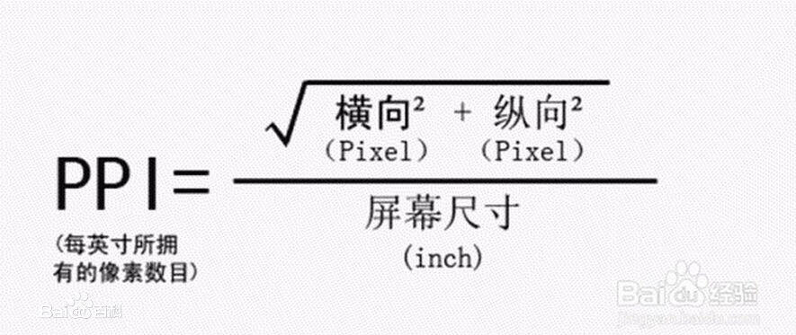

## 常见参数

> 屏幕尺寸            5.4英寸         屏幕对角线的长度(1英寸=2.54厘米)     
> 屏幕分辨率           1920x1080px    像素是分辨率的单位.竖向1920个像素块,横向有1080个像素块        
> 屏幕像素密度      424ppi    

## 分辨率比

高宽像素比 1920:1048 即 16:9

## 屏幕像素密度

每英寸所拥有的像素数,英文简称PPI(pixels per inch)

## 像素的大小是固定的吗?

像素没有实际的物理尺寸, 它的大小由屏幕尺寸和分辨率共同决定, 同一个ppi的像素大小可以说是一样的.

## Retina

手机屏幕距离眼睛10-12英寸时,分辨率达到一定水平,屏幕PPI只要达到300PPI,人眼视网膜就无法分辨出像素点了,这样的屏幕被称为"视网膜屏幕"(简称Retina).

简单来说就是屏幕PPI超过300的就叫Retina.

通常电脑显示屏幕的分辨率为72PPI.

